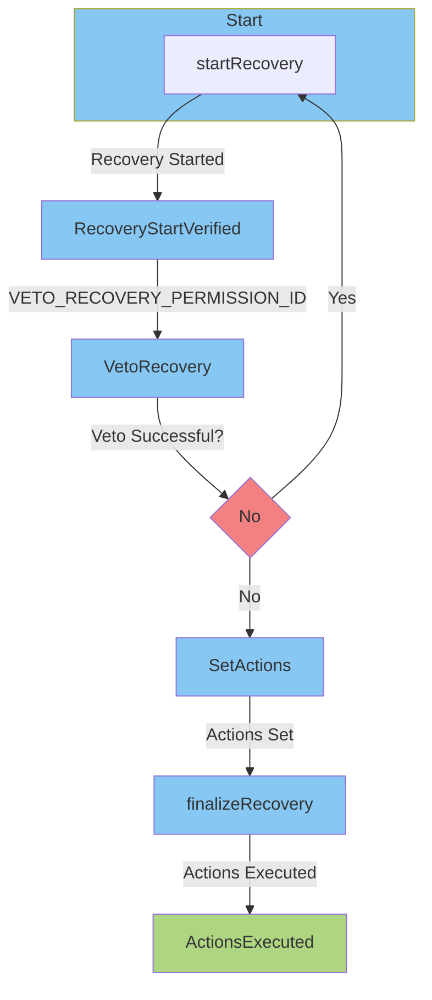

# Aragon Recovery Plugin

This plugin is designed to facilitate recovery processes within a decentralized
autonomous organization (DAO) using the Aragon framework. The contract allows
for the initiation of a recovery process, vetoing the recovery during a
specified period, and finalizing the recovery by executing a set of predefined
actions on the DAO.

## Overview

The RecoveryPlugin contract extends the `PluginCloneable` contract from the
Aragon framework and introduces recovery-related functionality. The key features
of the contract include:

- **Recovery Initiation**: Any user can initiate the recovery process by calling
  the `startRecovery` function.

- **Vetoing the Recovery**: During a specified veto period, users with the
  `VETO_RECOVERY_PERMISSION_ID` are authorized to veto the recovery process,
  resetting the recovery if successful.

- **Setting Actions**: After the veto period or if the veto is unsuccessful,
  users can set a series of actions to be executed on the DAO by calling the
  `setActions` function.

- **Finalizing the Recovery**: Users can call the `finalizeRecovery` function to
  execute the set actions on the DAO after the veto period.

## Contract Structure

The contract is structured as follows:

- **Initialization**: The contract is initialized with a reference to the DAO,
  veto duration, and initial set of actions.

- **Recovery Start**: The recovery process is initiated using the
  `startRecovery` function.

- **Vetoing the Recovery**: Users with the appropriate permission can veto the
  recovery using the `vetoRecovery` function during the specified veto period.

- **Setting Actions**: Users can set the actions to be executed during the
  recovery process using the `setActions` function.

- **Finalizing the Recovery**: After the veto period, users can finalize the
  recovery by calling the `finalizeRecovery` function, which executes the
  predefined actions on the DAO.

## Permissions

The contract relies on Aragon's permission system, and the following permissions
are utilized:

- `VETO_RECOVERY_PERMISSION_ID`: Permission required to veto the recovery
  process during the specified period.

- `UPDATE_ACTIONS_ID`: Permission required to update the set of actions to be
  executed during the recovery process.

- `UPDATE_VETO_PERIOD_ID`: Permission required to update the duration of the
  veto period.

## Flowchart

## License

This contract is licensed under the UNLICENSED license. See the
[LICENSE](LICENSE) file for details.

## Disclaimer

This contract is provided as-is without any warranties. Use it at your own risk,
and thoroughly test it in a safe environment before deploying to a live network.

Feel free to contribute, report issues, or suggest improvements by creating an
issue or pull request.

Happy coding!
